# Short-term electrical load forecasting

The aim of this project has been to provide meaningful estimations of the electrical energy load demand in Switzerland. 
This problem is an instance of time series day-ahead forecasting, meaning that the objective has been to predict the
hour-by-hour energy consumption for a given day given the data of the preceding days, resulting in a prediction of 24
values. We show the efficiency of neural networks for solving the task and verify how variations on the baseline method 
affect the results, with particular attention paid to the Anchored Input Output method described in the next sections.

## Running the program

To install the necessary requirements:

`pip install -r requirements.txt`.

The program can then be run by editing the `forecast.sh` file with the desired experiment settings and executing 

`./forecast.sh`.

## Data visualization

The data can be downloaded from the SwissGrid website (https://www.swissgrid.ch/en/home/operation/grid-data/generation.html)
in spreadsheet format with 15 minute resolution as shown in the following representation

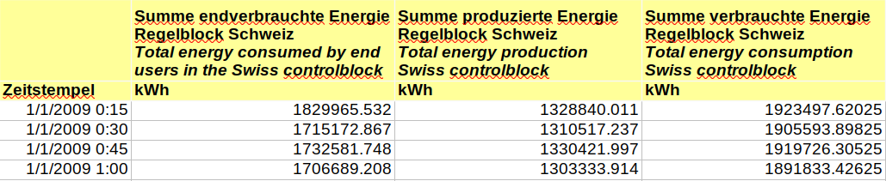

The value of interest in our case is the _Total energy consumption Swiss controlblock_. To turn the data into our 
desired format we have resampled it into hourly resolution by summing over the course of one hour, and converted the 
values to MWh. The final result is shown through a heatmap.

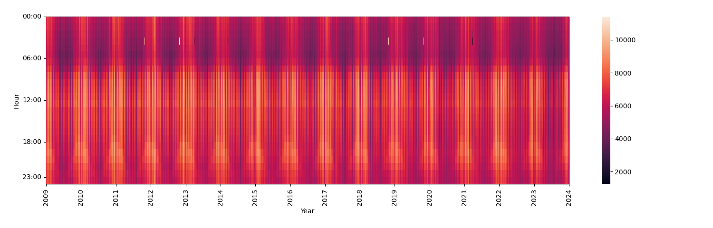

The heatmap highlights a yearly periodicity in the data with peaks around the end and the beginning of each year, the 
months around which the temperatures are the lowest.

## Input format

Our datapoints consisted of vectors in the space $\mathbb{R}^{75}$. Given a target day for prediction, the vectors are 
structured in the following way:

* 24 entries corresponding to the load values for each hour of the previous day
* 24 entries corresponding to the load values for each hour of the previous week
* 24 entries corresponding to the load values for each hour of the previous month
* 1 binary entry corresponding to whether the target day is a holiday
* 1 binary entry corresponding to whether the target day is a weekend
* 1 numerical entry corresponding to which day of the week the target day is

### AnIO - Anchored Input Output

We decided to test the efficiency of the AnIO method as described in the
[AnIO paper](https://link.springer.com/article/10.1007/s00521-023-09175-8). Such method consists in dividing each load 
value in the input vector by the load value a week prior (thus "anchoring" the load) and having the chosen model learn 
the difference in percentage rather than the actual load value. This allows the model to deal with smaller
quantities and variations and is expected to stabilize the learning curve. In the case of AnIO, our input vector is then
$`\left[\mathbf{l}_{d-1}^{d-7}, \mathbf{l}_{d-7}^{d-14}, \mathbf{l}_{d-28}^{d-35}, H, W, D\right]`$ where 
$`\mathbf{l}_{d}^{d-\alpha} = \frac{\mathbf{l}_d}{\mathbf{l}_{d-\alpha}} - 1`$.

#### Anio proof of concept

To showcase how the AnIO method is able to improve the precision of the forecasts, we carried out the same experiments 
presented in the paper, using the New England and Spain datasets which follow the same structure as the Swiss 
Consumption one.

This first example contains the MAPE results for the New England dataset 

  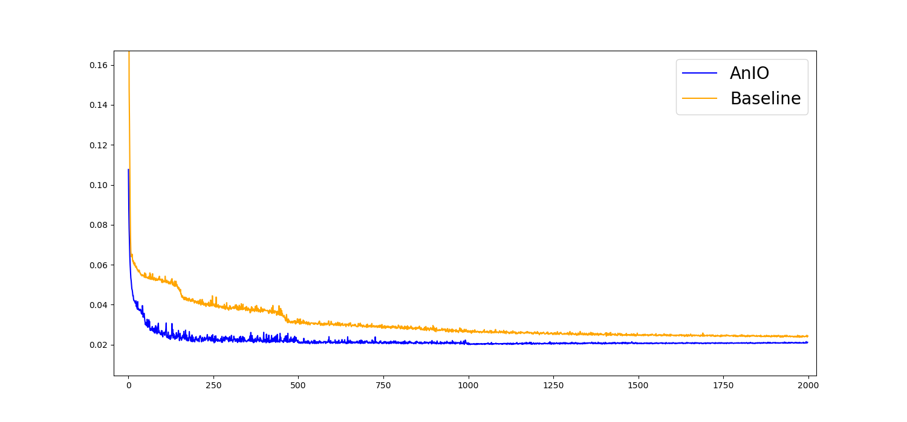

while the following for the Spain dataset.

  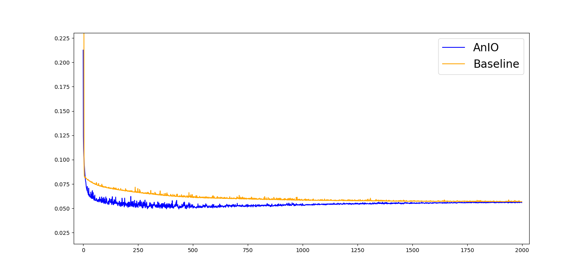

We notice the superiority of the AnIO approach in both these datasets, and based on these results we have decided to 
test it in the case of Swiss data.

## Experiments

### Scalers

We ran a group of preliminary experiments with a fixed setting, to test how different data scalers influenced the final 
predictions. Specifically, we tested a combination of no scaler, max scaler and standard scaler both on the features and
on the targets during training. 

The employed model was a two-layer residual network with 64 neurons per layer and GELU activation, trained 
with an Adam optimizer for 2000 epochs with a batch size of 32 samples to minimize the smooth L1 loss. We used a 
learning rate of 0.001 with a decay factor of 0.5 applied every 500 epochs. 

The quality of the results was measured through Mean Absolute Percentage Error (MAPE):
$`MAPE=\frac{100\%}{N}\sum_{i=1..N}\left\vert\frac{\mathbf{l}_{d_i}-\hat{\mathbf{l}}_{d_i}}{\mathbf{l}_{d_i}}\right\vert`$
where the $`\mathbf{l}_{d_i}`$s are the hours of the target vector and the $`\hat{\mathbf{l}}_{d_i}`$ the hours of our
prediction. In the case of AnIO forecasting, the test phase is preceded by a reconversion of the values in the original
load space through the formula $`\hat{\mathbf{l}}_{d}=\mathbf{l}_{d-\alpha}\cdot(\hat{\mathbf{l}}_{d}^{d-\alpha}+1)`$.

The results of the scaler experiments are gathered in the following table: 

  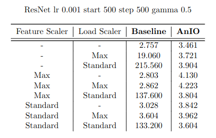

We can read that the best results have been achieved when no scaler is used in both the baseline and the AnIO methods. 
In particular, using a standard scaler for the load in the baseline case results in extremely high MAPE values, 
probably due to the fact that the data is not normally distributed.

### AnIO vs baseline

As can be noticed in the table, the final MAPE value for the AnIO method is worse than the baseline result. However, we 
can analyze the MAPE curve generated during training, taking as an example the unscaled datasets for both baseline and
AnIO.

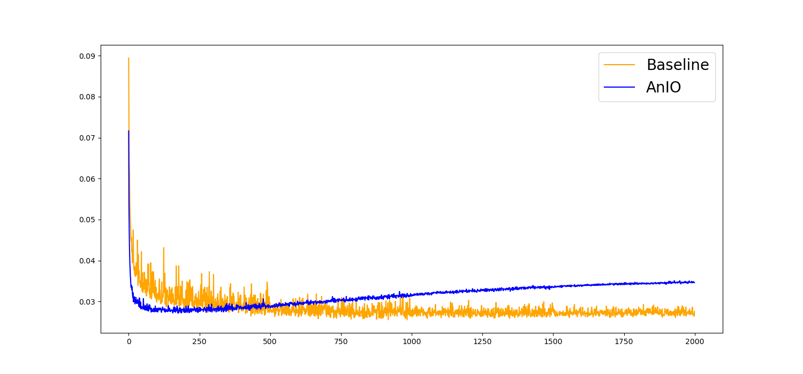

Without taking into account the oscillations of the baseline curve in orange, we notice that the AnIO method in 
blue achieves an MAPE very close to the final baseline one in the first 100 epochs before starting to overfit 
to the training data. This means that AnIO is in effect a more stable approach to the solution of the problem.
To further comment on this, we provide the graphs for experiments that were carried out by using ad-hoc hyperparameters
for both methods. 

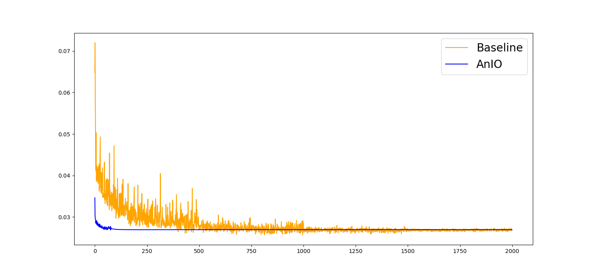

In this particular example, the learning rate was adjusted to 0.01 and the decay factor to 0.25 for the baseline in 
orange, while for AnIO in blue the decay factor is lowered to 0.001 and applied only once at epoch 80, which de facto
freezes the training process by greatly reducing the learning rate. Also, it must be noted that in this case the 
baseline was run with a max scaler on the features, while AnIO with a max scaler on the features and a standard scaler 
on the load. This experiment setting highlights how AnIO achieves its best MAPE much sooner than the baseline. 

The results using the best scalers and hyperparameters are gathered in the following table:

  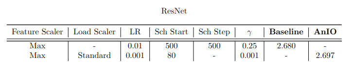

### Double loss
With respect to the result obtained by using the AnIO method as shown in the previous graph, it has been noticed that 
extending the model and computing the gradient at two separate steps yields a slightly better result. More in detail,
the loss is computed at the output of the original model and at the output of an extension of the model consisting of
two extra linear layers with a GELU nonlinearity in between (see next section). This approach showed no benefit in the 
baseline case. In the following graph we show a visualization of the improvement in the AnIO case, with the double loss
MAPE in red:

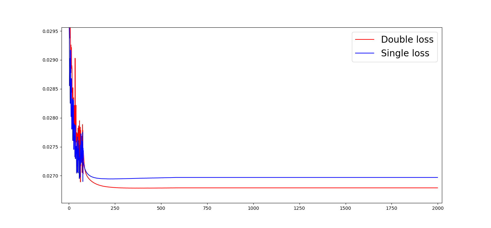

The final result using double loss on AnIO is shown in the following table, in which we have added the double loss 
results for the baseline method for completeness:

  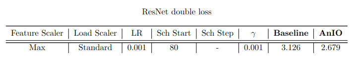

## Model structure

### Activation functions
With the setting described above that yielded the best results, the model was tested with two different activation 
functions: Rectified Linear Unit (ReLU) and Gaussian Error Linear Unit (GELU).  

The following is a plot of the baseline results, with ReLU in blue, where we can notice how the model employing ReLU
tends to overfit sooner despite maintaining a similar pace in the first epochs.

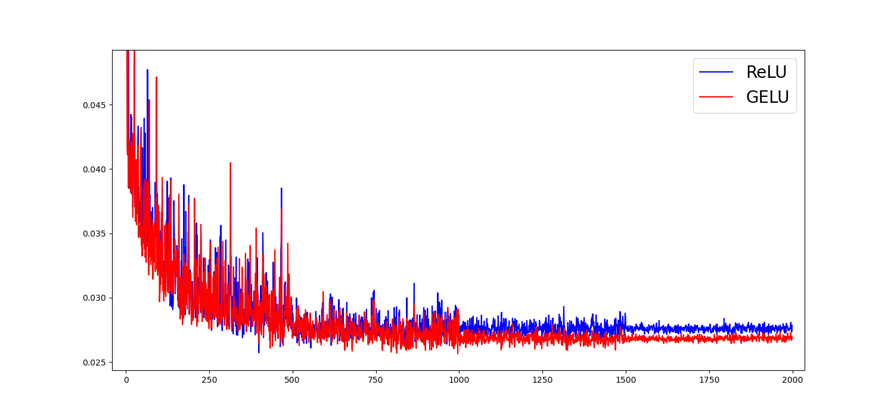

This next plot is a comparison between the AnIO results, with ReLU in blue. The superiority of the GELU case is 
evident from the very first epochs, and in the ReLU case we can also observe a slight overfitting. 

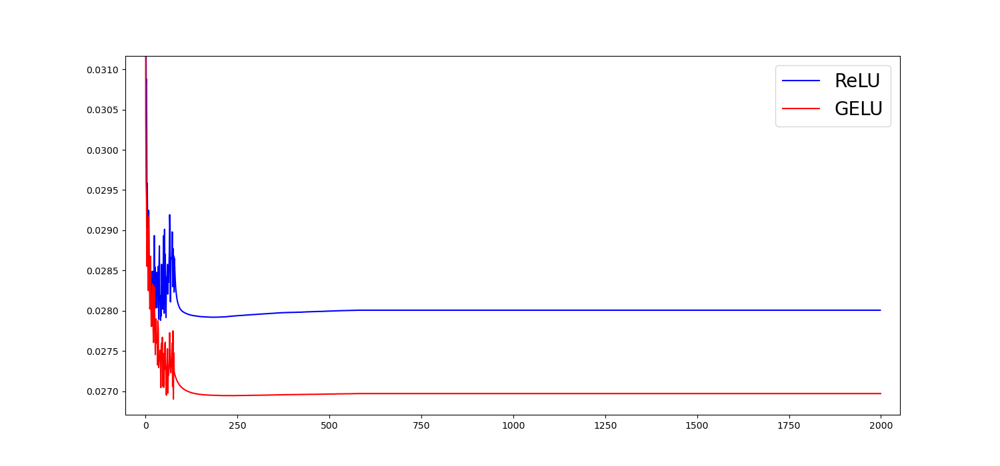

These observations led to using GELU as the default activation function for the residual network and the models tested
in the next section. The final results for both methods using the ReLU activation are gathered in the following table:

  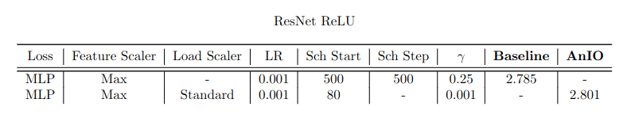

### Different model architectures

Aside from the ResNet model, experiments have been carried out in the best scaler case and the best hyperparameter case
for both AnIO and baseline with two other models. 

The first model is a simple Multilayer Perceptron (MLP), which is equivalent to the ResNet without the residual 
branches. The second is a single layer Long Short Term Memory (LSTM) network with a hidden size of 64. The final output
of the LSTM network is passed through a linear layer to obtain the final 24-hour predictions. 

The results of these experiments are gathered in the following table:

  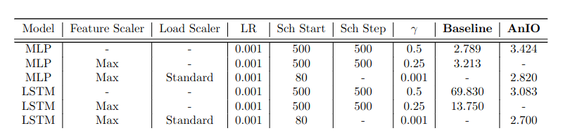

We can see how the MLP has a worse performance on the datasets except for the AnIO case with no scalers, in 
which it achieves a slightly lower MAPE. In the LSTM case, the AnIO performance with no scaler is also improved by a 
more significant factor compared to the ResNet, while the baseline results are completely unreliable. 

## Conclusions

The Anchored Input Output approach can yield significant improvements to the solution of the problem of time series 
forecasting when using deep neural networks. If a more accurate final result is not achieved when compared with the
baseline method, it still provides a faster and more stable training curve, reaching a better precision hundreds of 
epochs sooner than the baseline.

